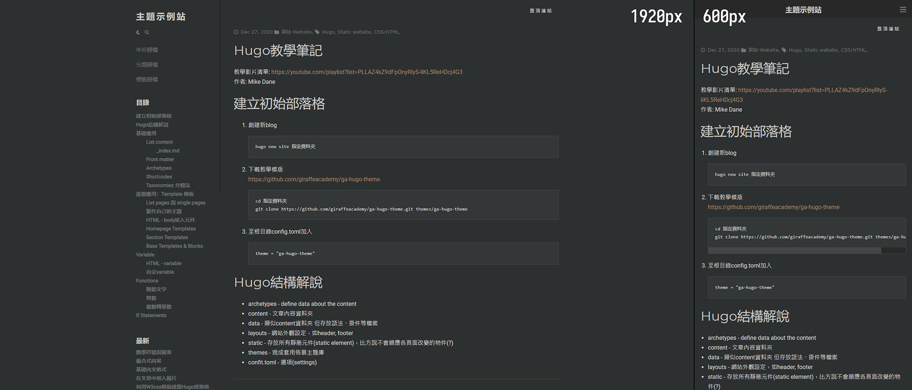

# Earl Grey

Earl Grey是[HUGO靜態網頁生成器](https://gohugo.io/)的佈景主題，響應式、極簡風格、使用左側欄菜單。一開始單純是做來放置自己的markdown筆記，想想還是就拿來獻醜吧，有需要的歡迎取用，放這邊就是開源的意思，想怎樣修改都行。



[中文展示頁面](https://dev1913.d3ls83qtpuaitz.amplifyapp.com/)  
緩慢建置ing，有些功能尚未加上去。

**特色**
- 響應式，側欄在螢幕寬度低於992px會自動隱藏
- 自動生成文章目錄，閱覽文章時可隨時從側欄查看目錄
- 支援分類(category)、標籤(tag)
- 三種歸檔頁(archive)：按照年份分組、按照分類分組、按照標籤分組
- 可顯示最首最末頁的分頁器
- 支援圖片燈箱：[Simple Lightbox](https://dbrekalo.github.io/simpleLightbox/)
- 支援數學符號：[MathJax](https://www.mathjax.org/)
- 支援圖表語言：[Mermaid](https://mermaid-js.github.io/mermaid)

## 使用

透過終端下載Earl Grey

```
git clone https://github.com/offrecordrae/EarlGrey themes/EarlGrey
```
config.toml
```
theme = "EarlGrey"
paginate = 5
[markup]
    [markup.goldmark]
    [markup.goldmark.renderer]
    unsafe = true
    [markup.tableOfContents]
    endLevel = 3
    ordered = false
    startLevel = 1
```
md文章內容放置路徑：`根目錄/content/posts`

## 建置環境

工具 | 提供者 | 版本 | 掛載來源
---|---|---|---
靜態網頁生成器 | [HUGO](https://gohugo.io/) | 0.79.1 |
CSS框架 | [W3.CSS](https://www.w3schools.com/w3css/) | [4.13](https://www.w3schools.com/w3css/4/w3.css) | [W3.CSS](https://www.w3schools.com/w3css/w3css_downloads.asp)
程式腳本 | Javascript | [3.5.1](https://cdn.jsdelivr.net/npm/jquery@3.5.1/dist/jquery.min.js) | cdnjs
圖標套件 | FontAwesome | [5.15.1](https://cdnjs.cloudflare.com/ajax/libs/font-awesome/5.15.1/css/all.min.css) | cdnjs

## 測試環境

- 瀏覽器
    - Chrome 87.0.4280.141
    - Edge 87.0.664.75
    - Firefox 84.0.2
- 系統
    - Windows 10
    - Android 9、7.1.1

## 特別感謝  
在主題中使用的許多程式語言都取自其他網站。

援引部份 | 來源 | 作者
---| --- | ---
GO語言相關框架 |  [Hugo theme: Mainroad](https://github.com/Vimux/Mainroad) | Vimux
MathJax與Mermaid的markup | [零壹軒筆記](https://note.qidong.name/) | 匿蟒
圖片燈箱 | [Simple Lightbox](https://dbrekalo.github.io/simpleLightbox/) | Damir Breakalo
分頁器 | [Pagination模版](https://github.com/gohugoio/hugo/blob/master/tpl/tplimpl/embedded/templates/pagination.html) | Joe Mooring、Bjørn Erik Pedersen、Cameron Moore、Mark Mandel、Anthony Fok

## 關於我

綽號喇叭子，本業是搞畫圖的，腦子和程式/網頁語言基本沒什麼緣份，只是當興趣偶而摸兩下。

個人網站 - [OFF RECORD](http://www.off-record.net/)
